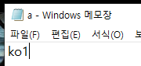
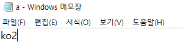
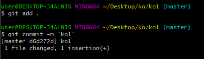
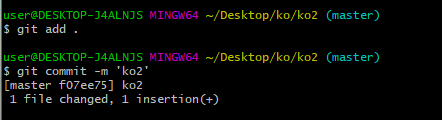
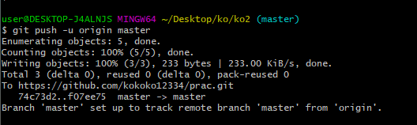
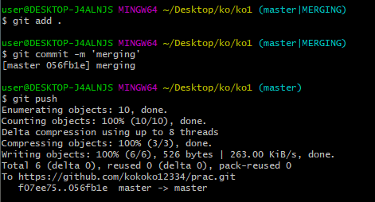

# 1. Git 초기 설정

 누가 커밋 기록을 남겼는 지 확인하기 위해 이름과 이메일을 설정한다.

```
git config --global user.name '이름'
git config --global user.email '이메일 주소'
```

###### 


# 2. Git 명령어

#### **(1)  로컬 저장소**

##### `Working Directory(=Working Tree)`:   *사용자의 작업 파일*

##### `Staging Area(=Index)`:   *커밋을  위한 파일 및 폴더가 추가되는 영역*

##### `Head(commit된 상태)`: Staging  Area에 있는 파일을 기록하고 원격 저장소에 보내는 영역

##### `Repository`:    *Staging rea에 있던 파일 및 폴더의 커밋을 저장하는 곳*


Git은 ***Working Directory***,  ***Staging Area***, ***Head***, ***Repository*** 순으로 버전 관리를 수행한다.

​	


#### (2)  git  init

- `git init`는 현재 작업중인 폴더 영역을 Git으로 관리한다는 명령어이다.(로컬 저장소 지정)

- 폴더 안에서 숨김폴더 해제를 하면 git. 폴더가 보인다.

- 맨 뒤에 `(master)`표시가 뜬다.

```
git init
```


######       


#### (3) git add

- `git add 파일명` 은 선택한 파일을 Staging Area로 보내는 명령어이다.

- `git add .`는 해당 폴더 안의 모든 파일을 Staged 상태로 변경한다 

```
git add practice
git add .      
```


#### (4) git status

`git status`는 해당 폴더 안의 파일의  상태를 보여준다.

- `untracked`:  Git이 관리하지 않음(한번도 Staging Area에 올라간 적이 없음.)
-  `Tracked`: Git이 관리함(한번이라도 `git add`를 했다는 뜻)
  - `Unmodified`: 최신 버전
  - `Modified `: 수정되었고 커밋이 필요한 상태.
  - `Staged`: Staing Area에 올라간 상태
  - 


#### (5) git commit

- `git commit -m 'practice 1'`는 Staging Area에 있는 파일의 변경 사항을 하나의 버전(커밋)으로 저장하는 명령어

- 해당 버전은 고유의 ID를 가진다.

- (root-commit)은 해당 커밋이 최초의 커밋일 때만 표시가 된다.

- 기타

  - `shift enter`를 누르면 다음줄로 넘어가서 긴 메세지를 한줄에 쓸 필요 없어 진다.
  - `git commit`를 하면 메세지를 다른 창에서 설정할 수 있게 되고 i를 누르고 title-> 엔터 두번 -> 내용 -> esc ->:wq로 메세지를 만들 수 있다.

  


#### (6) git log

`git log`는 커밋의 내역(ID, 작성자, 시간, 메세지 등)을 조회할 수 있는 명령어

삭제, 수정, 융합, 취소 모든 내력이 기록된다.

- 옵션
  - `--oneline` : 한 줄로 축약해서 보여줍니다.
  - `--graph` : 브랜치와 머지 내역을 그래프로 보여줍니다.
  - `--all` : 현재 브랜치를 포함한 모든 브랜치의 내역을 보여줍니다.
  - `--reverse` : 커밋 내역의 순서를 반대로 보여줍니다. (최신이 가장 아래)
  - `-p` : 파일의 변경 내용도 같이 보여줍니다.
  - `-2` : 원하는 갯수 만큼의 내역을 보여줍니다. (2 말고 임의의 숫자 사용 가능)


# 3. Github 이용

#### (1) 원격 저장소

- 생성된 `Repository(원격 저장소)`의 주소를 복사한다.


- 로컬 저장소(git init한 폴더)와 원격 저장소를 연결시킨다.

  `git remote add origin https://github.com/kokoko12334/TIL.git`(origin은 변수명인데 관습상 origin을 쓴다.)

  

- 원격 저장소가 잘 연결 되었는지 확인한다.

  

  - `git remote -v`

  

  - `git remote rm origin` : 원격 저장소 연결을 삭제

​			


#### (2) 원격 저장소 업로드

- `git push` 는 로컬 저장소의 커밋(`git add`, `git commit`한 파일)을 원격저장소(`git remote add`한 경로)에 업로드하는 명령어 이다.

```
git push origin  master  #origin이라는 이름의 원격 저장소의 master 브랜치에 push한다.

git push -u origin master #-u는 해당 원격저장소를 지정한 것으로, 그 다음 새로운 커밋을 푸쉬할 때 git push만 입력하면 된다.

```


# 4. PUSH 요약

- 순서

  ```
  git config --global user.name '이름'
  git config --global user.email '이메일 주소'
  
  1. git init      #로컬 저장소 생성
  
  2. git add practice.md
     git add .          #파일을 로컬 저장소(working dictatory, staging area에 넣기)
  
  3. git status     #파일 상태 확인
  
  4. git commit -m 'my practice'  #staging area에 있는 파일을 commit으로 기록
  
  5. git log  #commit 기록 확인
  
  6. git remote add origin https://github.com/kokoko12334/TIL.git  #로컬저장소와 원격저장소 연결
  
  7. git remote -v  #연결된 원격저장소 확인
  
  8. git push origin master #로컬저장소에 있는 commit을 원격저장소에 전송
  
  
  ```


# 5. gitignore


- gitignore은 git관리하에 있지만 github에는 올리고 싶지않은 파일(사적이거나 중요한 정보 등)을 지정할 때 사용한다.

- gitignore은 gitadd를 하기 전에 미리 생성하고 그 목록을 정해야 작동이 된다.(필터 개념)

- 생성된 `.gitignore`은 보통 메모장 형식이다.

- 생성된 `.gitignore`안의 목록들이 github 등록되지 않는다.(예: a.txt가 안에 있다면 a.txt는 github에 등록되지 않는다.)

- `gitignore` 자체의 파일은 github에 올라가고 안의 목록도 볼 수 있다.

- [유용한 gitignore목록](https://www.toptal.com/developers/gitignore)

  ```
  vi .gitignore
  touch .gitignore           #gitignore 파일 생성


# 6. github 파일 불러오기


#### 1) git clone

- clone은 빈 폴더에서 완전 새로이 파일을 받을 때 사용

```
git clone <clone하려는 원격저장소 주소>        #폴더가 새로 추가 생성된다.
git clone <clone하려는 원격저장소 주소> .         #폴더 추가없이 복사한다.
```

```
git init
git remote add origin <주소>
git pull origin master                           #이 방법도 있지만 clone이 효율적이므로 그냥 이런 방법도 있다 정도만 알아두자
```


#### 2) git pull

- pull은 파일은 이미 있고 gihub에서 수정된 파일을 받을 때 사용

```
git pull origin master 
git pull                     #원격 저장소 주소(내가 받고자 하는 파일의)가 이미 연결 되었다면 git pull만 해도 된다.
```


#### 3) 충돌 발생시 대처하기

- 상황

```
폴더1, 폴더2 안에는 같은 파일인 a.txt가 있다고 하자
폴더1의 a를 수정하고 폴더2의 a도 수정하는 데 각자 다르게 수정한다.
각 폴더 안의 a를 add, commit까지 시킨다. 이때 commit을 안하면 사전에 오류가 난다.
폴더1의 a를 먼저 push하고 폴더2에서 push한 파일 pull한다.
이때 두개의 a가 출동이 생겨서 merging이 생긴다.
```

 

>ko1/a.txt 수정

 

>ko2/a.txt 수정


 

>ko1/a.txt  add,commit


 

>ko2/a.txt add,commit


 

>ko2/a.txt 먼저 push


 

>ko1폴더에서 push된 a.txt를 pull


 

>다음과 같이 ko1/a.txt랑 ko2/a.txt가 충돌이 생기고 수정자가 판단해서 지울 것은 지움.


 

> 수정된 파일을 add, commit, push하면 ko1/a.txt의 변경사항이 저장됨.


# 7. git branch


#### 1) branch 생성

```
브랜치랑 작업방을 이야기하고 작업방에 이동, 파일 추가, 수정을 할 수 있다. branch를 생성하려면 하나 이상의 commit된 파일이 있어야 한다.
수정, 추가된 파일은 모든 브랜치에 반영되지만 해당 작업실(브랜치)에서 add, commit이 되었다면 그 다음부터는 해당 브랜치에서만 추가, 수정된 파일이 보인다.
한마디로, commit된 파일을 복사한다고 생각하면 된다.
```

- `git branch new`: 새 브랜치 생성
- `git switch new`: 해당 브랜치로 이동
- `git switch -c new`: 새 브랜치를 생성하고 이동함.


#### 2) branch 조회


- `git branch`:브랜치 종류와 내가 위치한 브랜치를 표시한다.
- `git log --oneline --all --graph`: 브랜치의 가치체계를 시각적으로 보여준다.(--all을 안붙히면 해당 브랜치만 보여줌.)
  - 브랜치 안에 서로 다른 파일 추가, 수정의 commit이 하나 이상 있어야 가치가 생성된다.


#### 3) branch merge


- `git merge <합치는 브랜치>`: 합치는 브랜치의 내용을 추가한다.

-  총 3가지의 경우가 있고 다음과 같다.

  - conflict 발생

    

  > 이에 대한 대처는 위에서 언급했던 add, commit하고 내가 수정하고 싶은대로 수정하고 push하면 된다.	

  -  한 브랜치에서만 수정

  - conflict한 상황없이 둘다 수정했을 경우

    


- `git merge --abort`: add하기전  or  add하고commit하기 전에 merge한 것을 취소 하는 명령어


# 8. 이전 버전으로 이동하기


#### 1) restore

- `git restore a.txt`: a.txt를 수정하면 working directory에 수정한 버전의 a가 들어가는 데 아직 commit까지는 안갔다.

이때 수정 전의 파일인 a가 commit가 존재하고 이 commit을 working directory에 덮어 씌운다.

- `git restore a.txt --staged`: add된 a.txt(staging are에 있다는 뜻)를 다시 돌려 놓는다.


#### 2) rm --cached

- `git rm --cached a.txt`: working directory, staging area에서 a.txt를 추방한다.(단 commit에는 남는다.)
- `git rm --cached -r .`:`rm`의 의미는 하나만 삭제한다는 뜻으고 `-r`은 반복수행, 즉 모든 파일을 추방한다.


#### 3)git commit --amend

- `git commit --amend`: 맨 위에 있는 commit의 메세지를 수정한다. 
  - 만약 staging area에 파일이 있을 경우는 해당 파일의 commit 메세지를 원래 있던 commit 맨위의 메세지에 넣는다.


#### 4)reset

- `git reset --soft <commit ID>`: w,s는 남겨놓고 c만 변경(이동)한다. (commit하면 원래상태로 복구)
- `git reset --mixed  <commit ID>`: w만 남겨 놓고 s,c만 변경한다. (add, commit 하면 원래상태고 복구)
- `git reset --hard <commit ID>`: 그냥 다 없앤다.(해당 commit상태로 완전 복구) 
- `git reflog`: 모든 commit 조회

> 이때 commit ID는 앞의 4자리에만 입력해도 된다.


#### 5) revert

```
reset은 위의 코밋까지 다 지웠다. 하지만 revert는 지정한 commit만 삭제시킨다.
```

- `git revert <commit ID>`: 해당 코밋을 삭제하고 이는 맨 위에 revert했다는 commit 기록이 자동으로 생긴다.
- `git revert <지정코밋+1,삭제하는 코밋>`: 해당범위의 commmit을 지운다.(reset이랑 차이점은 revert라는 commit 기록이 남는다.)


# 9. 추가 내용 확인

#### 1) git diff

- `git diff`는 add전의 파일을 s/c와 비교하는 것이다.
  - 이때 s,c의 내용이 다르면 최신파일인 s랑 비교한다.
  
    > w,   (s/c)  비교=> w,s랑 비교함.
  
    ​	
  
  
  
  

- `git diff _staged`는 s/c를 비교한다.


```
-2
\
+2
처럼 나와있는데 이건 그냥 무시하고 +2아래 것이 수정사항
이다.
```


- 깃포크
  1) 포크를 눌러서 git upstream (포크한 원래 주소)
  2) git add...commit.. 진행하고 git push origin(내 주소) ko(브랜치주소)하고
  3)  깃헙에 가서 요청/합치기 하면 됨.

-포크한 주소를 업데이트 하려면

-git fetch upstream

-git merge upstream/main   (포크한 주소의 브랜치를 말함)

하면 됨.
